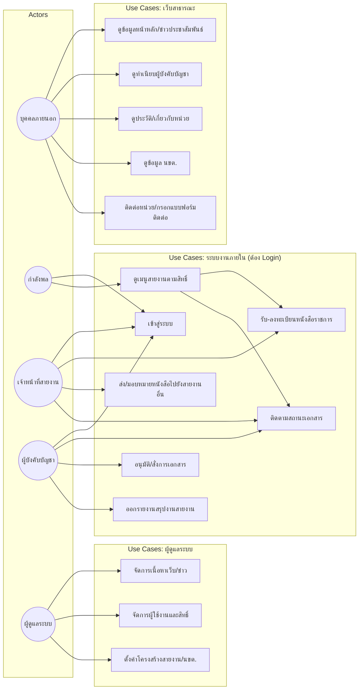
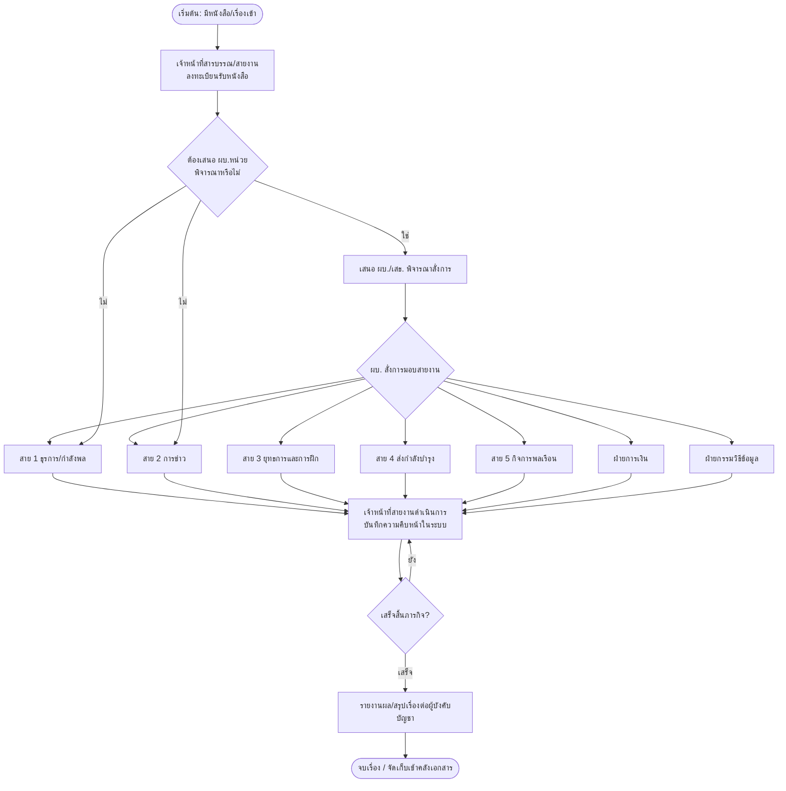
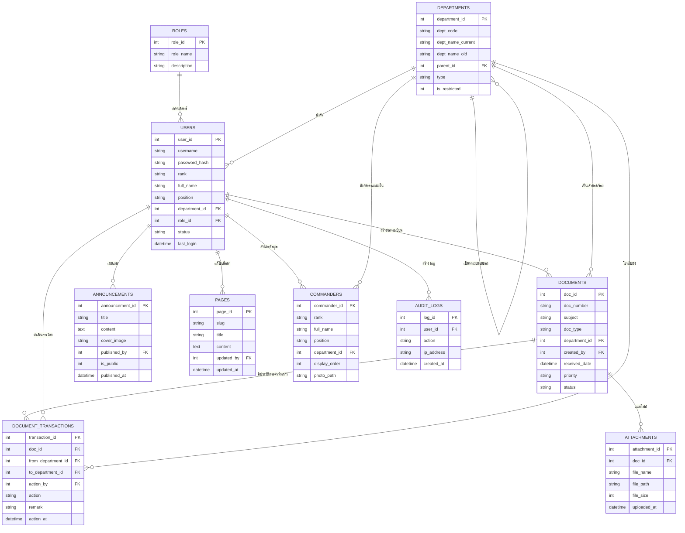

# แผนการพัฒนาเว็บไซต์หน่วยงาน กรมทหารราบ ๙๐๒ รักษาพระองค์ (ร.๙๐๒ รอ.)

> อ้างอิงโครงสร้างจากเว็บไซต์ตัวอย่าง `saraban.rta.mi.th` (กรมสารบรรณทหารบก) และปรับให้เหมาะสมกับบริบทของหน่วย ร.๙๐๒ รอ.

---

## 1. ภาพรวมโครงการ

| หัวข้อ | รายละเอียด |
|---|---|
| ชื่อหน่วย | กรมทหารราบ ๙๐๒ รักษาพระองค์ ในพระบาทสมเด็จพระเจ้าอยู่หัว (ร.๙๐๒ รอ.) |
| กลุ่มผู้ใช้งาน | (1) บุคคลภายนอก/ประชาชนทั่วไป (2) กำลังพลภายในหน่วย (3) เจ้าหน้าที่สายงาน (4) ผู้บังคับบัญชา (5) ผู้ดูแลระบบ |
| ลักษณะเว็บ | เว็บไซต์ 2 ชั้นสิทธิ์ (Public site + Intranet/สายงานภายใน ต้อง Login) |
| แกนหลักของระบบภายใน | ระบบสารบรรณ/ติดตามงานตามสายงาน (คล้ายต้นแบบ saraban.rta.mi.th) |

---

## 2. โครงสร้างเว็บไซต์ (Information Architecture / Sitemap)

```
หน้าหลัก (Public)
├── หน้าบ้าน
├── ผู้บังคับบัญชา ▾
│   ├── ทำเนียบอดีตเจ้ากรม
│   └── ผู้บังคับบัญชา (ปัจจุบัน)
├── เกี่ยวกับกรม
│   └── ประวัติหน่วย
├── นขต.ร.๙๐๒ รอ. ▾   (เปลี่ยนจาก นขต.สบ.ทบ.)
│   ├── กองพันทหารราบที่ 1 กรมทหารราบ ๙๐๒ รักษาพระองค์   (เดิม: กองธุรการ)
│   ├── กองพันทหารราบที่ 2 กรมทหารราบ ๙๐๒ รักษาพระองค์   (เดิม: กองการกำลังพล)
│   ├── กองพันทหารราบที่ 3 กรมทหารราบ ๙๐๒ รักษาพระองค์   (เดิม: กองการสารบรรณ)
│   ├── กองควบคุมคุณวุฒิ
│   ├── กองแผนและโครงการ
│   ├── โรงเรียนทหารสารบรรณ
│   ├── กองเทคโนโลยีสารสนเทศ
│   └── กองประวัติและบำเหน็จบำนาญ
├── ระบบงาน ▾  🔒 (แสดงเฉพาะกำลังพลที่ Login แล้ว)
│   ├── ฝ่ายธุรการและกำลังพล (สาย 1)     (เดิม: ระบบงานผ่าน App ThaiID | เป๋าตัง)
│   ├── ฝ่ายการข่าว (สาย 2)               (เดิม: ระบบงานภายใน สบ.ทบ.)
│   ├── ฝ่ายยุทธการและการฝึก (สาย 3)      (เดิม: ข่าวประชาสัมพันธ์ หน้าเว็บ)
│   ├── ฝ่ายส่งกำลังบำรุง (สาย 4)          (เพิ่มใหม่)
│   ├── ฝ่ายกิจการพลเรือน (สาย 5)          (เพิ่มใหม่)
│   ├── ฝ่ายการเงิน                        (เพิ่มใหม่)
│   └── ฝ่ายกรรมวิธีข้อมูล                 (เพิ่มใหม่)
└── ติดต่อเรา
```

**หลักการสิทธิ์การเข้าถึง**
- เมนู `หน้าบ้าน`, `ผู้บังคับบัญชา`, `เกี่ยวกับกรม`, `นขต.ร.๙๐๒ รอ.`, `ติดต่อเรา` → เปิดเผยสาธารณะ ไม่ต้อง Login
- เมนู `ระบบงาน` (7 สาย) → ต้อง Login ด้วยบัญชีกำลังพลเท่านั้น ระบบจะกรองแสดงเฉพาะสายงานที่ผู้ใช้มีสิทธิ์เข้าถึงตามตำแหน่ง/สังกัด

---

## 3. หน้าทำเนียบผู้บังคับบัญชา

หน้าเดียว แสดงรายชื่อผู้บังคับบัญชาปัจจุบันเรียงตามลำดับชั้น (การ์ด/ตาราง พร้อมยศ-ชื่อ-ตำแหน่ง):

| ลำดับ | ยศ-ชื่อ | ตำแหน่ง |
|---|---|---|
| 1 | พันเอก ณัฐวุฒิ สมพรหม | ผู้บังคับการกรมทหารราบ ๙๐๒ รักษาพระองค์ |
| 2 | พันเอก สุดแดน ศรีดามา | รองผู้บังคับการฯ ท่านที่ 1 |
| 3 | พันเอก นาวิน กุลไทย | รองผู้บังคับการฯ ท่านที่ 2 |
| 4 | พันเอก กฤษรินทร์ ดวงอุไร | เสนาธิการกรมทหารราบ ๙๐๒ รักษาพระองค์ |
| 5 | พันโท สุวิทย์ ทองแท่ง | ทำการแทนรองเสนาธิการฯ |
| 6 | พันโท ธีรชัย กำจร | ผู้บังคับกองพันทหารราบที่ 1 |
| 7 | พันโท โอฬาร ขอร่ม | ผู้บังคับกองพันทหารราบที่ 2 |
| 8 | พันโท วสันต์ อรรณพไกรสร | ผู้บังคับกองพันทหารราบที่ 3 |

ข้อมูลนี้จัดเก็บในตาราง `commanders` และดึงมาแสดงแบบไดนามิก เพื่อให้เจ้าหน้าที่ประชาสัมพันธ์แก้ไข/สลับตัวบุคคลได้เองผ่านหลังบ้าน (CMS) โดยไม่ต้องแก้โค้ด

---

## 4. หน้าประวัติหน่วย (เกี่ยวกับกรม)

สรุปเนื้อหาโดยย่อ (เขียนใหม่ ไม่ได้คัดลอกจากวิกิพีเดีย) สำหรับใช้เป็นโครงร่างเนื้อหา — ให้ทีมประชาสัมพันธ์ของหน่วยเรียบเรียงฉบับสมบูรณ์เอง:

- ที่มาของหน่วยและวันก่อตั้ง (พ.ศ. 2493)
- สังกัดปัจจุบัน: ขึ้นตรงกองพลทหารราบที่ 2 รักษาพระองค์ กองทัพภาคที่ 1
- ที่ตั้งกองบังคับการ: ค่ายมหาวชิราลงกรณ์ราชวัลลภ ตำบลบ้านสวน อำเภอเมืองชลบุรี จังหวัดชลบุรี
- สมญานามพระราชทาน "ทหารเสือนวมินทราชินี" / "ทหารเสือราชินี"
- ประวัติการเปลี่ยนชื่อหน่วย (จากกรมทหารราบที่ 21 รักษาพระองค์ สู่ กรมทหารราบ ๙๐๒ รักษาพระองค์)
- หน่วยขึ้นตรงปัจจุบัน (บก.1–3, ป.902 ฯลฯ)

> แนะนำให้แนบเอกสารทางการของหน่วย หรือให้ ฝ่ายกิจการพลเรือน/ฝ่ายการข่าว เป็นผู้ตรวจทานความถูกต้องก่อนเผยแพร่ เนื่องจากเป็นข้อมูลประวัติศาสตร์และเกียรติภูมิหน่วยที่ต้องแม่นยำ

---

## 5. บทบาทผู้ใช้งานและสิทธิ์ (Roles & Permissions)

| Role | คำอธิบาย | สิทธิ์เข้าถึง |
|---|---|---|
| `guest` | บุคคลภายนอก | อ่านหน้า Public ทั้งหมด |
| `staff` | กำลังพลทั่วไป | อ่านหน้า Public + เข้าเมนู "ระบบงาน" เฉพาะสายที่สังกัด |
| `dept_officer` | เจ้าหน้าที่ประจำสายงาน | จัดการเอกสาร/งานภายในสายของตน (รับ-ส่ง-ติดตามหนังสือ) |
| `commander` | ผู้บังคับบัญชา/หัวหน้าสายงาน | อนุมัติ/สั่งการเอกสาร, ดูภาพรวมทุกสายที่กำกับดูแล |
| `admin` | ผู้ดูแลระบบ/ประชาสัมพันธ์ | จัดการเนื้อหาเว็บ (CMS), จัดการผู้ใช้และสิทธิ์, ตั้งค่าระบบ |

---

## 6. Use Case Diagram



---

## 7. Workflow Diagram — วงจรเอกสารราชการภายในระบบงาน (สาย 1–5 / การเงิน / กรรมวิธีข้อมูล)



---

## 8. ER Diagram (โครงสร้างฐานข้อมูล)



### หมายเหตุการออกแบบตาราง `DEPARTMENTS`
ใช้ตารางเดียวคุมทั้ง 2 กลุ่ม โดยแยกด้วยคอลัมน์ `type`:
- `type = 'nkt'` → นขต.ร.๙๐๒ รอ. (บก.1–3, กองควบคุมคุณวุฒิ ฯลฯ) แสดงแบบ Public (`is_restricted = 0`)
- `type = 'saiwork'` → สายงานภายใน (สาย 1–5, การเงิน, กรรมวิธีข้อมูล) แสดงเฉพาะผู้ Login (`is_restricted = 1`)

วิธีนี้ทำให้เพิ่ม/แก้ไข/ย้ายสายงานในอนาคตทำได้จากหลังบ้านโดยไม่ต้องแก้โครงสร้างฐานข้อมูลหรือโค้ด

---

## 9. เทคโนโลยีที่แนะนำ (Tech Stack)

| ชั้นระบบ | ตัวเลือกแนะนำ | เหตุผล |
|---|---|---|
| Frontend | Bootstrap 5 + Blade (SSR) หรือ React (ถ้าต้องการ UI แบบ SPA) | ใกล้เคียงต้นแบบ saraban.rta.mi.th ดูแลง่าย ทีม IT หน่วยงานราชการคุ้นเคย |
| Backend Framework | **Laravel (PHP 8.2+)** | ระบบสิทธิ์ (RBAC), การจัดการฟอร์ม, Middleware สำหรับหน้า Login เหมาะกับเว็บราชการ, เอกสาร/ชุมชนนักพัฒนาไทยรองรับดี | 
| ทางเลือกอื่น | ASP.NET Core (C#) หรือ Next.js + Node.js | หากหน่วยมีนโยบายใช้ Microsoft Stack หรือทีมพัฒนาถนัด JS เต็มรูปแบบ |
| ฐานข้อมูล | MySQL 8 / MariaDB | เสถียร รองรับ Transaction สำหรับงานสารบรรณ, สำรอง/กู้คืนง่าย |
| การยืนยันตัวตน | Session-based Auth + RBAC (Spatie Laravel-Permission) รองรับต่อยอดเชื่อม ThaiID/บัตรประชาชนได้ในอนาคต | ควบคุมสิทธิ์ตามสายงานและยศ |
| ไฟล์แนบ/เอกสาร | จัดเก็บบน Local Storage/NAS ภายในหน่วย (ไม่ขึ้น Cloud สาธารณะ) เข้ารหัส path, จำกัดชนิดไฟล์ | ความมั่นคงปลอดภัยของข้อมูลราชการ |
| Web Server | Nginx + PHP-FPM, บังคับ HTTPS (TLS) | ตรงกับที่เห็นใน saraban.rta.mi.th (แม่กุญแจ HTTPS) |
| Hosting | เซิร์ฟเวอร์ภายในหน่วย/ศูนย์ข้อมูล ทบ. (Intranet-first) พร้อม DMZ สำหรับส่วน Public | ควบคุมความปลอดภัยข้อมูลกำลังพล |
| Backup | Cron job สำรองฐานข้อมูล + ไฟล์แนบ รายวัน เก็บ 30 วันย้อนหลัง | ป้องกันข้อมูลสูญหาย |
| Security | HTTPS, CSRF/XSS protection (มีในตัว Laravel), Rate limiting หน้า Login, Audit log ทุกการแก้ไข | เว็บราชการ/ทหารต้องเข้มงวดเรื่องความปลอดภัยไซเบอร์ |

---

## 10. แผนการดำเนินงาน (Roadmap)

```mermaid
flowchart LR
    P1[Phase 1\nออกแบบ UI/UX + IA\n(2 สัปดาห์)] --> P2[Phase 2\nพัฒนาเว็บ Public\nหน้าบ้าน/ผู้บังคับบัญชา/นขต./ประวัติ\n(3 สัปดาห์)]
    P2 --> P3[Phase 3\nพัฒนาระบบ Login + RBAC\n(2 สัปดาห์)]
    P3 --> P4[Phase 4\nพัฒนาโมดูลสารบรรณ/ระบบงาน 7 สาย\n(4 สัปดาห์)]
    P4 --> P5[Phase 5\nทดสอบระบบ + ทดสอบความปลอดภัย\n(2 สัปดาห์)]
    P5 --> P6[Phase 6\nอบรมผู้ใช้งาน + Go-live\n(1 สัปดาห์)]
```

**สรุประยะเวลาโดยประมาณ:** 12–14 สัปดาห์ (ไม่รวมการขออนุมัติ/จัดซื้อจัดจ้างตามระเบียบราชการ)

---

## 11. สิ่งที่ต้องเตรียม/ตัดสินใจเพิ่มเติมจากหน่วย

- รายชื่อ-รูปถ่ายผู้บังคับบัญชาความละเอียดสูง (สำหรับหน้าทำเนียบ)
- เนื้อหาประวัติหน่วยฉบับทางการที่ผ่านการรับรองจากฝ่ายการข่าว/กิจการพลเรือน
- รายชื่อกำลังพลและสังกัดสายงาน (สำหรับตั้งค่าบัญชีผู้ใช้เริ่มต้น)
- นโยบายเรื่อง Hosting (ใช้เซิร์ฟเวอร์ภายในหน่วย/ทบ. หรือใช้ Hosting ภาครัฐ เช่น GDCC)
- ผู้รับผิดชอบดูแลเนื้อหาเว็บ (Content Owner) ในแต่ละสายงานหลัง Go-live
